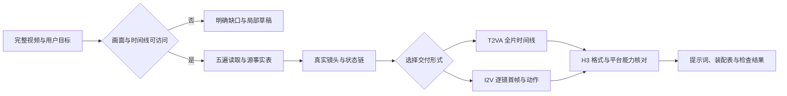

# MiniMax H3 视频反推 Skill

**上传参考视频，拆出真实镜头、首帧画面、连续动作与最终状态，再交付 MiniMax H3 可用的提示词。**

由 [知识猫 / gnipbao](https://github.com/gnipbao) 的 V6 反推模板与历史视频反推实践整理。支持 **AUTO · T2VA · I2V · DUAL**，默认保真反推，也支持用户明确要求的 10 秒重编排、多轮修改和长视频分段。

本项目提供 Agent Skill、使用教程、原创示例和本地校验工具。**不包含 H3 模型，不自动生成视频，不要求 API Key。** 0.1.0 为公开候选版本：已验证的软件检查与未验证的生成效果分别记录在 [验证说明](docs/validation.md)。

## 快速开始

安装到 Codex 用户技能目录：

```bash
mkdir -p "${CODEX_HOME:-$HOME/.codex}/skills"
git clone https://github.com/gnipbao/minimax-h3-video-reverse-skill.git \
  "${CODEX_HOME:-$HOME/.codex}/skills/minimax-h3-video-reverse"
```

如果目标目录已存在，先检查现有版本，`git clone` 会停止，不要直接覆盖。需要在其他支持 `SKILL.md` 的 Agent 中使用时，将整个仓库放入该工具支持的技能目录；具体发现方式以宿主文档为准。仅使用普通聊天界面时，可先提供 [SKILL.md](SKILL.md) 及所需参考文档，但模型仍须具备视频理解能力。

在能发现该技能的新会话中，附上完整参考视频并发送：

```text
$minimax-h3-video-reverse
帮我完整反推这段视频。输出模式 DUAL，保留真实镜头和原始动作顺序。
先给逐镜首帧与动态提示词，再给可复制的 H3 格式。
没有实际听清的声音不要补写。
```

模式规定的正式交付顺序以用户明确要求为先；无额外顺序要求时 DUAL 为完整 T2VA 在前、逐镜 I2V 在后。

## 它具体解决什么问题

普通反推很容易写成“电影感、高清、缓慢推近”。真正影响重新生成的，往往是另一些信息：爪子先碰到还是先收回、杯子为什么不见了、镜头到底切了还是拉远了、最后动作是否完成。

本 Skill 把这些问题变成执行顺序：



它会先检查视频，再决定怎样描述。角色数量、画幅、风格、光线、速度和配乐都不从模板自动继承。

## 四种模式怎么选

| 模式 | 适合需求 | 得到什么 |
| --- | --- | --- |
| AUTO | 不确定哪种生成方式更合适 | 根据视觉身份与时间信息选择交付路线 |
| T2VA | 需要完整、自包含的文生视频描述 | 全片时间线与 H3 三字段 Prompt |
| I2V | 希望先锁定外观，再生成每镜动作 | 首帧/首尾帧 Prompt、Motion、镜头约束和装配说明 |
| DUAL | 同时需要整体叙事与逐镜复刻 | 基于同一事实表的 T2VA 与 I2V 两套方案 |

逐镜 I2V 中，**I2V-A** 默认用单首帧；**I2V-B** 仅在平台确认支持、且尾帧确实有助于约束连续变化时采用首尾帧。它们是本项目的路线标签，不是 API 参数。

## 从历史反推中吸收了什么

| 历史场景 | 容易出错的地方 | 落到 Skill 的规则 |
| --- | --- | --- |
| 动物近距离互动 | 把触碰、撤回、再次发力合成一次推搡 | 分开记录接触与分离，反应跟随真正触发事件 |
| 举杯与面部特写 | 道具被遮住就写成消失；杯沿离开嘴部 | 追踪持有、接触、遮挡与再出现 |
| 改成 10 秒 I2V | 把源片切镜误称为原本的一镜到底 | 源镜头与目标镜头分开，列出用户授权改编 |
| 游戏风格长片 | 连续拉远被拆镜；加载插画被强制写实 | 真实切镜优先，允许镜头媒介变化 |
| 30 秒段落编排 | 把段落长度当成模型单次生成能力 | 段落与 Job 分层，按平台上限拆分 |
| 超现实动物变形 | “保持稳定”禁止了原本要发生的鼓胀 | 固定身份锚点，明确允许变化的几何区域 |
| 微缩动物开场修改 | 将用户新增的容器和动作伪装成观察事实 | 保存 intentional_deviations，保留原版 |
| 低动态植物与淡出 | 加戏、编环境音、把淡出写成天色变暗 | 保留静止时间，分开对象、相机与剪辑变化 |
| 行驶中的结尾 | 自动补成到达城市、停车 | 写真实截止状态，不代写结局 |

详细机制与反测条件见 [历史经验](references/historical-lessons.md)。这些是从文字产物提炼的规则，本次未重新验证全部历史原视频。

## 一次反推会怎样进行

1. **确认可读范围**：完整视频、时间、细节和音频是否实际可访问。
2. **完整浏览**：确认画幅、媒介、实体、开场与结尾。
3. **识别镜头**：真实切镜先行，连续运镜不人为拆分。
4. **补看关键动作**：接触、遮挡、快速反向、形变和 UI 闪现处提高检查密度。
5. **建立状态链**：记录谁持有什么、什么被遮住、什么真实改变、最后停在哪个状态。
6. **静动态分配**：首帧描述“此刻是什么”，Motion 描述“接下来怎么变”。
7. **编译与核对**：输出 H3 格式，检查时长、声音、源/目标映射与最终状态。

整个过程保留证据边界；交付的复制块只写生成信息，不混入内部推理或自检清单。

## H3 三字段与图生视频的关系

T2VA 的可复制块是：

```text
integrated_multimodal_description: [Shot 1] ...

overall_soundscape: ...

non_diegetic_music: ...
```

I2VA 在它之前加首帧对齐行；FL2VA 使用首尾帧对齐行。逐镜生产包里的负面约束，会按需要并入主描述，不当作额外 H3 API 字段。精确格式见 [H3 适配](references/h3-adapter.md)。

**声音没有听过，就不会凭画面添加。** 未核实音轨用 `audio_status: unavailable` 说明，未确认的声音字段填 `N/A`。这表示没有编入声音事实，不表示源片静音，也不保证生成平台自动输出静音。

**本项目的反推模式与 H3 多参考模式不同。** 用户要把图片、视频和音频实际送入 Ref2VA 时，可交接官方 [h3-prompt-writing](https://github.com/MiniMax-AI/MiniMax-H3)，本包的基础路线无需它也能阅读使用。

## 三个常用请求

### 原片逐镜复刻

```text
$minimax-h3-video-reverse
完整检查附件视频，输出 I2V。保留真实镜头，不压缩时间。
每镜给独立首帧提示词、动态提示词、H3 块和镜间装配说明。
中文解释，英文 Prompt；对白与画面文字保留原语言。
```

### 改成 10 秒图生视频

```text
$minimax-h3-video-reverse
以附件视频为依据，改编成 10 秒的一镜到底 I2V。
保留主角身份、动作先后与结尾表情，允许用连续收紧景别替代切镜。
明确列出源片与改编的差异，不新增未经核实的声音。
```

### 长视频按 30 秒组织

```text
$minimax-h3-video-reverse
把附件长视频反推后按 30 秒叙事段落组织。
先核实我的 H3 平台单次时长，超过上限就拆成多个 Job。
每个 Job 重置时间并给源时间映射，交接人物、道具与动作状态。
```

官方 [H3 FAQ](https://design.minimax.io/h3) 在 2026-09-20 核实时标注最长 15 秒；具体平台以实际支持为准。因此，“30 秒段落”通常需要多个生成任务与后期装配，不是单次生成承诺。

## 完整示例

- [10 秒动物动作：首帧、动态与 H3 块](examples/01-cat-and-ball.md)
- [8 秒产品展开：首尾帧与允许变化](examples/02-product-unfolding.md)
- [30 秒段落如何拆成实际任务](examples/03-long-video-plan.md)
- [能力不足、多轮修改与回归提示](examples/retest-prompts.md)
- [机器校验契约示例](examples/contract.json)

示例均为原创教学设定，不附第三方视频，不冒充真实视频观察或模型生成记录。

## 本地辅助工具

使用 Skill 本身不要求 Python。运行辅助检查需要 Python 3.10+；媒体元数据探测额外需要系统已安装 FFprobe。没有第三方 Python 依赖、联网请求、自动下载和密钥读取。

```bash
# 在仓库目录运行：检查文件、链接、示例与校验器回归
python3 scripts/check_repo.py

# 核对一份交付契约
python3 scripts/validate_contract.py examples/contract.json

# 只读取本地视频元数据；不会分析画面和声音内容
python3 scripts/probe_video.py /path/to/reference.mp4
```

校验器会发现时间缺段/重叠、越界参考帧、未知首尾帧能力、超限 Job、H3 字段顺序、无依据的音频字段等结构问题。它不能判断画面是否看对、动作是否复刻成功、文字是否抄对，也不会把“通过”转成生成质量评分。

## 仓库结构

```text
SKILL.md                 Agent 入口与执行协议
agents/openai.yaml       Codex 显示信息
references/              观察、输出、H3 格式、历史经验、来源
examples/                原创教学案例与人工反测
scripts/                 媒体元数据与契约/仓库检查
tests/                   时间、能力与格式的回归测试
docs/validation.md       实际验证范围与证据缺口
```

用户素材与生成结果放自己的项目目录。`outputs/`、`runs/`、凭据和媒体默认忽略；不要把运行数据写进已安装 Skill。

## 来源与许可

原方法：[MiniMax H3 视频反推提示词模板V6](https://ycnj2htgnvdy.feishu.cn/wiki/E55pwC9xYinpHekxrGscwgPTn0d)。整理方法：[dao-skill](https://github.com/gnipbao/dao-skill)。完整来源边界见 [provenance](references/provenance.md)。

本仓库原创代码、文档与教学示例采用 [MIT License](LICENSE)。MiniMax H3 模型、官方资料和第三方素材不因本仓库开源而更改许可。本项目为社区整理，与 MiniMax 官方没有隶属关系。
