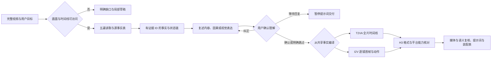

# MiniMax H3 视频反推 Skill

**提供参考视频，AI 先复述内容和叙事逻辑；你确认或纠正后，再交付 MiniMax H3 可用的提示词。**

由 [知识猫 / gnipbao](https://github.com/gnipbao) 的 V6 反推模板与历史视频反推实践整理。支持 **AUTO · T2VA · I2V · DUAL**，默认保真反推，也支持用户明确要求的 10 秒重编排、多轮修改和长视频分段。

本项目提供 Agent Skill、使用教程、原创示例和本地校验工具。**不包含 H3 模型，不自动生成视频，不要求 API Key。** 当前本地开发版为 **0.3.0 候选版本**：新增人机叙事确认，保留事实绑定、确定性编译和复核检查；真实生成效果仍待对照，见 [验证说明](docs/validation.md)。版本说明不代表已经发布 GitHub Release。

## 0.3.0：先看懂，再动笔

动作描述完整，故事仍可能理解错。因此默认分两阶段：先用中文说清“发生了什么、为什么相连、最后怎样”，标出关键疑点；你确认后才给 Prompt。非剧情视频改为沟通视觉表达、动作方式或演示目的，不硬编一个故事。

- 可以直接纠正人物关系、手机用途、动作姿势、反转和艺术效果，AI 更新理解后再确认。
- “改成这样，直接写”已包含执行要求，不多问一轮；已有确认时，改语言或合并成一段直接复用。
- “只要一段提示词”保留最终输出简洁，首轮仍先确认；明确说“不用确认，直接写”可以跳过，但不会冒充已确认。
- 未听清的声音、未证实的制作方法和角色动机不会因为用户认可故事就变成观察事实。

交互过程见 [完整示例](examples/04-narrative-confirmation.md)。新生产包的 pending 或过期确认会阻止编译；旧 v2 无确认字段只兼容草稿，严格交付检查会拒绝。脚本只检查声明和摘要，无法代替真实沟通或判断故事是否理解正确。

## 保留的反推能力

继续减少动作合并、两套提示词各写各的，以及修改后沿用旧复核的问题。

| 能力 | 现在怎样处理 |
| --- | --- |
| 接触与动作顺序 | 接近、触碰、撤回、再次接触、反应分别绑定事实；可声明前驱顺序 |
| 证据约束 | 单帧不能作为连续动作的全部依据；未知内容留在缺口表 |
| T2VA / I2V 一致 | 从同一事实表编译，每条路线完整覆盖源时间线 |
| 尾段与分段 | 自动抽取首尾帧；保留黑场、截止状态；续段绑定当前姿势 |
| 修改后的复核 | 改事实、时间或资源会使旧复核失效；直接改派生 Prompt 会被拒绝 |
| 声音边界 | 实际听过源声音与目标支持声音分别核对，均满足才编入 |

这些检查能拦截明确的结构性漂移。事实句写错、帧中细节误读、相机与主体运动混淆，仍需实际观看和语义复核；脚本不理解画面。

## 快速开始

安装到 Codex 用户技能目录：

```bash
mkdir -p "${CODEX_HOME:-$HOME/.codex}/skills"
git clone https://github.com/gnipbao/minimax-h3-video-reverse-skill.git \
  "${CODEX_HOME:-$HOME/.codex}/skills/minimax-h3-video-reverse"
```

如果目标目录已存在，先检查现有版本，`git clone` 会停止，不要直接覆盖。需要在其他支持 `SKILL.md` 的 Agent 中使用时，将整个仓库放入该工具支持的技能目录；具体发现方式以宿主文档为准。仅使用普通聊天界面时，可先提供 [SKILL.md](SKILL.md) 及所需参考文档，但模型仍须具备视频理解能力。

在能发现该技能的新会话中，附上完整参考视频并发送：

```text
$minimax-h3-video-reverse
帮我完整反推这段视频。输出模式 DUAL，保留真实镜头和原始动作顺序。
先用中文复述视频内容、叙事逻辑或视觉表达，并说明关键疑点，等我确认。
确认后给逐镜首帧与动态提示词，再给可复制的 H3 格式。
没有实际听清的声音不要补写。
```

模式规定的正式交付顺序以用户明确要求为先；无额外顺序要求时 DUAL 为完整 T2VA 在前、逐镜 I2V 在后。

## 它具体解决什么问题

普通反推很容易写成“电影感、高清、缓慢推近”。真正影响重新生成的，往往是另一些信息：爪子先碰到还是先收回、杯子为什么不见了、镜头到底切了还是拉远了、最后动作是否完成。

本 Skill 把这些问题变成执行顺序：



它会先检查视频，再与用户对齐怎样理解和复现。角色数量、画幅、风格、光线、速度和配乐都不从模板自动继承。

## 四种模式怎么选

| 模式 | 适合需求 | 得到什么 |
| --- | --- | --- |
| AUTO | 不确定哪种生成方式更合适 | 根据视觉身份与时间信息选择交付路线 |
| T2VA | 需要完整、自包含的文生视频描述 | 全片时间线与 H3 三字段 Prompt |
| I2V | 希望先锁定外观，再生成每镜动作 | 首帧/首尾帧 Prompt、Motion、镜头约束和装配说明 |
| DUAL | 同时需要整体叙事与逐镜复刻 | 基于同一事实表的 T2VA 与 I2V 两套方案 |

逐镜 I2V 中，**I2V-A** 默认用单首帧；**I2V-B** 仅在平台确认支持、且尾帧确实有助于约束连续变化时采用首尾帧。它们是本项目的路线标签，不是 API 参数。

## 从历史反推中吸收了什么

| 历史场景 | 容易出错的地方 | 落到 Skill 的规则 |
| --- | --- | --- |
| 动物近距离互动 | 把触碰、撤回、再次发力合成一次推搡 | 分开记录接触与分离，反应跟随真正触发事件 |
| 举杯与面部特写 | 道具被遮住就写成消失；杯沿离开嘴部 | 追踪持有、接触、遮挡与再出现 |
| 改成 10 秒 I2V | 把源片切镜误称为原本的一镜到底 | 源镜头与目标镜头分开，列出用户授权改编 |
| 游戏风格长片 | 连续拉远被拆镜；加载插画被强制写实 | 真实切镜优先，允许镜头媒介变化 |
| 30 秒段落编排 | 把段落长度当成模型单次生成能力 | 段落与 Job 分层，按平台上限拆分 |
| 超现实动物变形 | “保持稳定”禁止了原本要发生的鼓胀 | 固定身份锚点，明确允许变化的几何区域 |
| 微缩动物开场修改 | 将用户新增的容器和动作伪装成观察事实 | 保存 intentional_deviations，保留原版 |
| 低动态植物与淡出 | 加戏、编环境音、把淡出写成天色变暗 | 保留静止时间，分开对象、相机与剪辑变化 |
| 行驶中的结尾 | 自动补成到达城市、停车 | 写真实截止状态，不代写结局 |

详细机制与反测条件见 [历史经验](references/historical-lessons.md)。这些是从文字产物提炼的规则，本次未重新验证全部历史原视频。

## 一次反推会怎样进行

1. **确认可读范围**：完整视频、时间、细节和音频是否实际可访问。
2. **完整浏览**：确认画幅、媒介、实体、开场与结尾。
3. **识别镜头**：真实切镜先行，连续运镜不人为拆分。
4. **补看关键动作**：接触、遮挡、快速反向、形变和 UI 闪现处提高检查密度。
5. **建立状态链**：记录谁持有什么、什么被遮住、什么真实改变、最后停在哪个状态。
6. **复述并确认**：说明内容、叙事因果或视觉表达、结尾及疑点，等待确认；用户纠正则更新对应理解。
7. **静动态分配**：确认后，首帧描述“此刻是什么”，Motion 描述“接下来怎么变”。
8. **编译与核对**：对照已确认目标，检查 H3 格式、时长、声音、源/目标映射与最终状态。

整个过程保留证据边界；交付的复制块只写生成信息，不混入内部推理或自检清单。

## H3 三字段与图生视频的关系

T2VA 的可复制块是：

```text
integrated_multimodal_description: [Shot 1] ...

overall_soundscape: ...

non_diegetic_music: ...
```

I2VA 在它之前加首帧对齐行；FL2VA 使用首尾帧对齐行。逐镜生产包里的负面约束，会按需要并入主描述，不当作额外 H3 API 字段。精确格式见 [H3 适配](references/h3-adapter.md)。

**声音没有听过，就不会凭画面添加。** 未核实音轨用 `audio_status: unavailable` 说明，未确认的声音字段填 `N/A`。这表示没有编入声音事实，不表示源片静音，也不保证生成平台自动输出静音。

**本项目的反推模式与 H3 多参考模式不同。** 用户要把图片、视频和音频实际送入 Ref2VA 时，可交接官方 [h3-prompt-writing](https://github.com/MiniMax-AI/MiniMax-H3)，本包的基础路线无需它也能阅读使用。

## 三个常用请求

以下请求默认先复述并确认，列出的生产内容在确认后交付。确认后要求“一段就行”时，直接压成一段，不额外输出大型报告。

### 原片逐镜复刻

```text
$minimax-h3-video-reverse
完整检查附件视频，输出 I2V。保留真实镜头，不压缩时间。
每镜给独立首帧提示词、动态提示词、H3 块和镜间装配说明。
中文解释，英文 Prompt；对白与画面文字保留原语言。
```

### 改成 10 秒图生视频

```text
$minimax-h3-video-reverse
以附件视频为依据，改编成 10 秒的一镜到底 I2V。
保留主角身份、动作先后与结尾表情，允许用连续收紧景别替代切镜。
明确列出源片与改编的差异，不新增未经核实的声音。
```

### 长视频按 30 秒组织

```text
$minimax-h3-video-reverse
把附件长视频反推后按 30 秒叙事段落组织。
先核实我的 H3 平台单次时长，超过上限就拆成多个 Job。
每个 Job 重置时间并给源时间映射，交接人物、道具与动作状态。
```

官方 [H3 FAQ](https://design.minimax.io/h3) 在 2026-09-20 核实时标注最长 15 秒；具体平台以实际支持为准。因此，“30 秒段落”通常需要多个生成任务与后期装配，不是单次生成承诺。

## 完整示例

- [10 秒动物动作：首帧、动态与 H3 块](examples/01-cat-and-ball.md)
- [8 秒产品展开：首尾帧与允许变化](examples/02-product-unfolding.md)
- [30 秒段落如何拆成实际任务](examples/03-long-video-plan.md)
- [从内容复述、用户纠正到确认后输出](examples/04-narrative-confirmation.md)
- [能力不足、多轮修改与回归提示](examples/retest-prompts.md)
- [v2 事实输入示例](examples/evidence-contract.input.json)
- [事实契约与严格复核流程](references/evidence-contract.md)
- [v1 格式草稿，仅作兼容参考](examples/contract.json)

示例均为原创教学设定，不附第三方视频，不冒充真实视频观察或模型生成记录。

## 本地辅助工具

阅读 Skill 和人工草稿不要求 Python。使用编译与检查工具需要 Python 3.10+；媒体探测需要系统已安装 FFprobe，抽帧另需 FFmpeg。没有第三方 Python 依赖、联网请求、自动下载和密钥读取。

```bash
# 在仓库目录运行：检查文件、链接、示例与校验器回归
python3 scripts/check_repo.py

# 编译旧教学输入，仅得兼容草稿；新任务先记录真实 narrative_review
python3 scripts/compile_contract.py examples/evidence-contract.input.json --output /tmp/h3-contract.json
python3 scripts/validate_contract.py /tmp/h3-contract.json

# 只读取本地视频元数据；不会分析画面和声音内容
python3 scripts/probe_video.py /path/to/reference.mp4

# 指定关键时刻；自动包含首尾帧，记录实际 PTS，仍需人工/视觉模型观看
python3 scripts/sample_frames.py /path/to/reference.mp4 --output /tmp/h3-frames-new --at 0.5 2 4
```

对真实任务，先按 [确认协议](references/narrative-confirmation.md) 获得当前叙事确认或用户明确豁免，再完成媒体和语义检查，按 [契约说明](references/evidence-contract.md) 填写复核记录，运行：

```bash
python3 scripts/validate_contract.py /path/to/contract.json --require-reviewed --verify-local-media
```

教学例没有用户确认、真实媒体和复核记录，因此不能通过这条严格检查。不要自动把它改成 confirmed 或 reviewed。v1 仅保留格式校验，不能声明生成就绪。

校验器能检查叙事确认声明、事实引用、时间缺段/重叠、分段当前状态、音频通道、派生文字一致性、复核摘要和本地文件哈希。它不能判断用户是否真的确认、画面是否看对或动作是否复刻成功。问答必须来自真实会话；复核记录与哈希都不是生成质量评分。

## 仓库结构

```text
SKILL.md                 Agent 入口与执行协议
agents/openai.yaml       Codex 显示信息
references/              观察、输出、H3 格式、历史经验、来源
examples/                原创教学案例与人工反测
scripts/                 PTS 抽帧、事实编译、契约与仓库检查
tests/                   证据、动作顺序、分段、复核失效与格式回归
docs/validation.md       实际验证范围与证据缺口
docs/evolution-0.2.md    失败证据、修改决策、复测与回滚
docs/evolution-0.3.md    叙事误读、人机确认与验证边界
```

用户素材与生成结果放自己的项目目录。`outputs/`、`runs/`、凭据和媒体默认忽略；不要把运行数据写进已安装 Skill。

## 来源与许可

本项目根据维护者的方法模板与历史反推实践整理。整理方法：[dao-skill](https://github.com/gnipbao/dao-skill)。完整来源边界见 [provenance](references/provenance.md)。

本仓库原创代码、文档与教学示例采用 [MIT License](LICENSE)。MiniMax H3 模型、官方资料和第三方素材不因本仓库开源而更改许可。本项目为社区整理，与 MiniMax 官方没有隶属关系。
